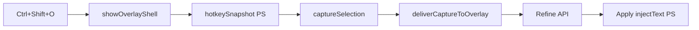

## Full prompt (copy-paste content)

```markdown
# PromptForge — UX bug hunt, flaw repair, and optimization

You are auditing and fixing **PromptForge** (`c:\Users\julez\Apps\prompt-master`): a Windows-only Electron + Vite + React/TypeScript app that captures text from the active Windows field/terminal via Ctrl+Shift+O, refines prompts through an overlay, and injects results back with Apply.

## Goal

**Fix and optimize the user experience.** Find bugs, broken flows, dangerous flaws, and UX regressions — understand root causes, fix them, and re-verify until the goal is reached.

You own discovery. Do not wait for a pre-made bug list. Read the codebase, trace flows, run tests, and infer what a real user would hit.

## Definition of done

The goal is reached when ALL of the following hold:

1. **`npm test` passes** — all vitest suites green
2. **`npm run lint` passes** (or only pre-existing issues you did not introduce)
3. **Core gold-path UX works end-to-end** (code review + tests; manual Windows verification where you can):
   - Ctrl+Shift+O: overlay shell appears **instantly** (glass visible before capture completes); captured text fills in shortly after
   - Capture auto-populates from active text field **and** terminal (Cursor/VS Code integrated, Windows Terminal, conhost) — manual paste is not acceptable as the primary path
   - Refine/Generate triggers rewrite only on button press (not on overlay open)
   - Apply injects refined text back into the **same** captured target; on inject failure, refined text stays on clipboard (never restore pre-capture clipboard over the fallback copy)
   - Overlay is draggable, remembers position, no black scrim, no laggy reopen flicker
   - Terminal rewrite output is **single line** (no newlines in output textarea)
4. **No dangerous regressions** introduced — especially: hotkey order, blur-hide during capture, PS `WinFg` duplicate `Add-Type`, clipboard handling, or silent API fallbacks
5. **Remaining known gaps** are documented honestly with reproduction steps

## What counts as a bug or dangerous flaw

Prioritize findings that hurt real users:

| Severity | Examples |
|----------|----------|
| **Critical** | Data loss (clipboard overwrite on failed inject), capture/inject completely broken on a host, overlay steals focus and breaks capture, crashes on hotkey, API key exposure, silent mock rewrite on provider failure |
| **High** | Slow/laggy overlay reopen, empty capture when text exists, wrong field injected, terminal noise/window-title leaks in overlay, Enter triggers Refine when it should newline, hotkey path regressed to capture-before-shell |
| **Medium** | Confusing error messages, broken keyboard shortcuts, position not persisted, typewriter jank, footer layout regressions |
| **Low** | Cosmetic-only issues — fix only if trivial and zero risk |

## UX invariants — DO NOT break these while fixing

Read [`AGENTS.md`](AGENTS.md) fully; treat it as contract. Key non-negotiables:

- Hotkey order: `prepareCaptureTarget()` → `showOverlayShell()` → `hotkeySnapshot()` → `captureSelection()` → `deliverCaptureToOverlay()` — **never** capture-before-shell
- Blur hide must **skip** while `hotkeyInFlight` is true
- PS: `terminal-io.ps1` owns `WinFg`; no unguarded duplicate `Add-Type` in dot-sourced scripts
- Rewrite uses GPT-4.1 mini only; no silent `optimizeLocal` fallback on API failure
- Overlay output = plain refined text only; no JSON/rubric UI
- App UI strings stay English
- Do not add acrylic/`GlassSurface` to overlay window; glass is CSS on `.apple-glass` only
- RAM/memory optimizations must not change hotkey/capture/Refine/Apply behavior

## Architecture map (start here)



| Area | Key files |
|------|-----------|
| Hotkey + overlay lifecycle | [`src/main/main.ts`](src/main/main.ts) |
| Capture/inject bridge | [`src/main/capture.ts`](src/main/capture.ts), [`src/main/win32.ts`](src/main/win32.ts) |
| Inject routing | [`src/shared/injectStrategy.ts`](src/shared/injectStrategy.ts) |
| Terminal detect/normalize | [`src/shared/terminalDetect.ts`](src/shared/terminalDetect.ts), [`src/shared/terminalCapture.ts`](src/shared/terminalCapture.ts), [`src/shared/terminalOutput.ts`](src/shared/terminalOutput.ts) |
| Overlay UI | [`src/renderer/views/Overlay.tsx`](src/renderer/views/Overlay.tsx) |
| Rewrite pipeline | [`src/engine/orchestrator.ts`](src/engine/orchestrator.ts), [`src/engine/providers.ts`](src/engine/providers.ts), [`src/engine/guideLoader.ts`](src/engine/guideLoader.ts) |
| PS scripts | [`scripts/win-hotkey-snapshot.ps1`](scripts/win-hotkey-snapshot.ps1), [`scripts/win-inject.ps1`](scripts/win-inject.ps1), [`scripts/terminal-io.ps1`](scripts/terminal-io.ps1), [`scripts/inject-strategy.ps1`](scripts/inject-strategy.ps1) |
| Tests | `src/**/*.test.ts` (13 files) |
| Terminal skill reference | [`.cursor/skills` or user skill `promptforge-terminal-capture`] |

PS script edits apply on next hotkey without rebuild. TypeScript changes need `npm test` and dev reload.

## How to work

### Phase 1 — Discover (you do this; no pre-audit was done for you)

1. Read `AGENTS.md`, then trace the gold path through main → capture → overlay → orchestrator → inject
2. Run `npm test` and `npm run lint`; note failures
3. Grep for TODO/FIXME/HACK, error swallowing, race conditions (`hotkeyInFlight`, `pollInFlight`, blur handlers)
4. Compare hotkey flow in [`main.ts`](src/main/main.ts) against documented order — flag any drift
5. Review inject/capture PS scripts for `WinFg` collisions, STA clipboard, focus-restore timing
6. Review [`Overlay.tsx`](src/renderer/views/Overlay.tsx) for UX traps: Enter behavior, capturing state, terminal single-line enforcement, Apply/Copy/Discard
7. Build a prioritized bug list with severity, file, and user-visible symptom

### Phase 2 — Fix loop

For each item (critical → high → medium):

1. Reproduce via code path analysis or failing test
2. Fix with **minimal diff** — match existing conventions; no drive-by refactors
3. Add or adjust unit test if behavior was untested and fix is testable without Windows UI
4. Re-run `npm test` (and `npm run lint` after TS changes)
5. Mark item verified or blocked

Repeat until definition of done is met or you are blocked on manual Windows-only verification.

### Scope guards

```
Don't add features, refactor, or introduce abstractions beyond what fixing the bug requires.
Don't redesign overlay visuals unless fixing a confirmed UX bug.
Don't change rewrite model, pricing, or add new model picker entries unless directly fixing a bug.
Do the simplest fix that works well.
```

### Autonomy rules

```
When you have enough information to act, act. Do not re-derive facts already established in the conversation or re-litigate decisions already documented in AGENTS.md.

Pause and ask me ONLY for:
- Destructive or irreversible git operations (force push, hard reset)
- A real scope change (new feature, redesign)
- Information only I can provide (e.g. "does Apply work in Cursor terminal on your machine?" when you cannot verify)

For reversible fixes that follow from this goal, proceed without asking.

Before reporting progress or completion, audit each claim against a tool result from this session. If something is not verified, say so explicitly.
```

### Verification checklist (manual — note gaps honestly)

If you cannot run Windows UI tests, state which items are code-verified only vs need human confirmation:

- [ ] Hotkey from Chrome text field → capture → Refine → Apply
- [ ] Hotkey from Cursor chat input → capture → Apply
- [ ] Hotkey from Cursor integrated terminal → single-line output → Apply
- [ ] Hotkey from Windows Terminal → capture → Apply
- [ ] Inject failure → refined text on clipboard, overlay stays usable
- [ ] Second hotkey open feels as fast as first (no double-popup flicker)
- [ ] Overlay drag + position persist across reopen


## Final report format

When done (or blocked), return:

1. **Outcome** — one sentence: goal reached / partially reached / blocked
2. **Bugs found** — table: severity | symptom | root cause | fix | verified?
3. **Changes made** — files touched and why
4. **Test evidence** — `npm test` / `npm run lint` output summary
5. **Not verified** — items needing manual Windows testing
6. **Recommended follow-ups** — only if blocked or out of scope

Do not stop at analysis. Ship fixes until the definition of done is met or you hit a blocker only I can resolve.
```
