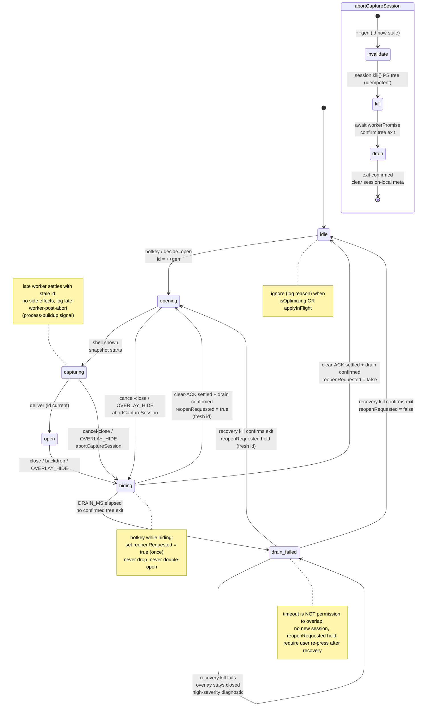

# Fix rapid hotkey capture session concurrency

## Review consensus (resolved from 3 independent reviews)

This rewrite reconciles an adversarial **Reject**, a reliability-alignment **Aligns-with-edits**, and a feasibility **Approve-with-changes** review. Decisions encoded here:

- **Session model over a bare int** — a `CaptureSession { id, state, kill, workerPromise, frozenTarget }` state machine, not just `captureGeneration`. The counter is renamed **`hotkeySessionGeneration`** and is explicitly *distinct* from the C7 Apply clipboard generation token in `hotkey-reliability.plan.md`.
- **Real cancellation, not cooperative-only** — abort must terminate the active PowerShell process tree; dismiss invalidates the id, aborts the worker, and awaits a **bounded drain** before a new session may start. Cooperative-only checks alone were rejected as insufficient.
- **No dead reopen window** — `hotkeyInFlight` is no longer overloaded as toggle-close. A pure `decideHotkeyAction()` returns `ignore | close | cancel-close | open | queue-reopen`; a single `reopenRequested` intent during `hiding` resolves the drop-vs-200ms-reopen contradiction (never a silent unbounded drop).
- **Correlated transition protocol** — every overlay transition carries a `transitionId`; `OVERLAY_PREPARED` must echo it; resolvers live in a `Map<transitionId, resolver>`; stale/unknown ACKs are ignored. The old "resolve all waiters on any ACK" behavior is removed.
- **Apply reentrancy is a real hole** — add `applyInFlight` around inject; capture cannot start during Apply. Added to root causes.
- **Do not mutate `capture.ts` globals mid-flight** — pending capture/UIA meta becomes session-local so a second press cannot corrupt a still-running worker.
- **Scope discipline** — this plan owns *only* hotkey session concurrency. Capture outcomes, freeze, deadlines, clipboard, inject, terminal safety remain governed by `hotkey-reliability.plan.md` + `docs/hotkey-reliability-gate.md`. Terminal capture stays UIA-only (never Ctrl+C / keyboard-copy); the `promptforge-terminal-capture` skill is **not** authoritative where it conflicts.
- **Measurable verification** — the soft checklist is replaced by deterministic unit tests plus numeric soak/gate criteria.

**Round-2 review consensus.** Feasibility and Reliability both **Approve with minor nits**; the Adversarial review raised four blockers, all folded in here: (1) drain timeout now enters a `drain-failed` quarantine (never permission to overlap workers); (2) ACK identity is an immutable per-handler `transitionId`, not "last received"; (3) Apply owns dismissal via `applyDismissedGeneration` (no reopen after dismissal); (4) release runs the **full** `docs/hotkey-reliability-gate.md`, with race soaks additive. Medium nits also applied: explicit `CaptureSessionContext` params (no shared-global backdoor), transition-queue non-reentrancy, recoverable failed-drain/transition-timeout states, and `CAPTURE_COPY` / `STUDIO_OPEN_WORKBENCH` enumerated as hide entrypoints.

## Scope

**In scope (this plan):** concurrency and lifecycle correctness of the hotkey capture session — decision logic, cancellation/drain, overlay transition serialization, Apply reentrancy, and their tests/diagnostics.

**Out of scope (owned elsewhere or explicitly excluded):**
- Capture-outcome contract, freeze-before-snapshot, SLA deadlines/kill budgets, clipboard ownership, inject result mapping, terminal UIA-only safety → **`hotkey-reliability.plan.md`** and **`docs/hotkey-reliability-gate.md`** remain authoritative. Where this plan touches those areas (e.g. exposing a kill handle), it must not weaken their contracts.
- UIA performance rewrite / speeding the Cursor snapshot below its 950ms shared deadline.
- Changing the overlay-first order or the `prepareCaptureTarget → showOverlayShell → snapshot → capture → deliver` sequence.
- Inventing a new inject bridge or altering `PF_INJECT_*` semantics.

## Root causes (from logs + code)

1. **`hotkeyInFlight` blocks toggle-close** — `triggerHotkey` (`anvyll/src/main/main.ts:384`) returns early on `hotkeyInFlight` *before* checking `overlaySessionOpen`, so a second press during the ~1.5–3.8s snapshot is silently dropped even though glass is already visible. *(Keep — accurate.)*
2. **Close path is unlocked** — `hideOverlay()` clears `overlaySessionOpen` immediately then awaits the renderer ack; a reopen can start concurrently while hide is still running. *(Keep — accurate.)*
3. **Single shared `overlayPreparedResolve`** — concurrent hide/show/deliver overwrite each other's waiter (`waitForOverlayPrepared`, `main.ts:178`), so any one ACK resolves whichever promise happens to be installed → flaky opacity/clear/show ordering. *(Keep — accurate.)*
4. **No capture generation / real abort** — Esc / `OVERLAY_HIDE` mid-capture does not stop the flow; `deliverCaptureToOverlay` (`main.ts:202`) re-reveals the session when `!overlaySessionOpen`. There is no id to invalidate and nothing kills the in-flight PowerShell worker. *(Keep — accurate; strengthened below to real kill + drain.)*
5. **Long Cursor UIA snapshot** (logs 1.5–1.8s, one **3831ms**) widens the race window. *(Secondary; do not fix perf here — owned by reliability plan.)*
6. **Shell-then-`FocusWindow` churn** during that window makes UIA reads flakier under rapid reopen. *(Secondary; keep overlay-first order per AGENTS.)*
7. **User-visible "failures" are mostly dropped presses or stale reopen**, not empty fast-path. *(Keep — framing.)*
8. **Apply/inject reentrancy hole (new)** — nothing prevents a hotkey from starting a capture while an Apply (`CAPTURE_INJECT` → `hideOverlayForInject` → inject → `finalize`/`revealFallback`) is in flight. A press during Apply can spawn a concurrent capture over a mutating target. *(New — from feasibility + reliability reviews.)*

## Chosen behavior

**Cancel-and-toggle, with a bounded reopen queue.** An open or in-flight session is cancelled and closed by the next press (real abort + drain). A press that arrives *while hiding* records exactly one `reopenRequested` intent and starts one fresh session after the hide's clear-ACK completes — so a close→reopen within ~200ms succeeds instead of being dropped. Presses during `isOptimizing` or `applyInFlight` are ignored. The load-bearing capture order and the blur-skips-while-capturing rule are preserved (the state machine now defines the exception cases explicitly).

## A. Session model

Introduce a single owned session object in `main.ts` (source of truth; no parallel booleans as the authority):

```ts
type CaptureState = "idle" | "opening" | "capturing" | "open" | "hiding" | "drain-failed";

interface CaptureSession {
  id: number;                 // === hotkeySessionGeneration at creation
  state: CaptureState;
  kill: (() => void) | null;  // terminates the PS process tree for this session
  workerPromise: Promise<void> | null; // resolves when the worker fully settles
  frozenTarget: FrozenTarget | null;   // session-local snapshot/UIA meta
  reopenRequested: boolean;   // at most one queued reopen while hiding
}
```

- `hotkeySessionGeneration` is a monotonic int; each new session takes `id = ++hotkeySessionGeneration`. **This is not the C7 Apply clipboard generation token** — different lifecycle, different owner. Name it distinctly and note the distinction in a comment.
- **Session-local pending capture / UIA meta.** The pending capture payload and frozen UIA metadata live on the `CaptureSession` (or keyed by `id`), *not* in shared `capture.ts` module globals. A second press must never clear or mutate the globals a still-running worker is reading. Access is via an explicit **`CaptureSessionContext`** passed as a parameter (or keyed storage by `id`) — **no "current owner" shared-global backdoor**. A stale worker cannot stomp a new one because it only ever touches its own keyed context.
- **Session resolution after migration.** `CAPTURE_INJECT` and `CAPTURE_COPY` currently read the "current" capture; after migration they must resolve the session explicitly — carry the owning `id`/`transitionId` from the overlay that issued the action and look up that `CaptureSessionContext` by id, rather than reading a mutable current-owner global. If the referenced session is no longer current (superseded/aborted), the handler clears only and does not act on stale meta.

### Legal state transitions

| From | Event | To |
| --- | --- | --- |
| idle | hotkey (decide=open) | opening |
| opening | shell shown, snapshot starts | capturing |
| capturing | deliver succeeds (id current) | open |
| opening/capturing | hotkey (decide=cancel-close) / OVERLAY_HIDE / blur-after-abort | hiding |
| open | hotkey (decide=close) / OVERLAY_HIDE / backdrop / CAPTURE_COPY / STUDIO_OPEN_WORKBENCH | hiding |
| hiding | clear-ACK settled + drain confirmed, no reopenRequested | idle |
| hiding | clear-ACK settled + drain confirmed, reopenRequested set | opening (fresh id) |
| hiding | drain times out (no confirmed tree exit) | drain-failed |
| drain-failed | recovery kill confirms tree exit, no reopenRequested | idle |
| drain-failed | recovery kill confirms tree exit, reopenRequested held | opening (fresh id) |
| drain-failed | recovery kill fails | drain-failed (overlay stays closed; high-severity diagnostic; await user re-press) |
| capturing | worker settles but id stale | (no-op; log late worker) |

`CAPTURE_COPY` and `STUDIO_OPEN_WORKBENCH` are hide entrypoints: both dismiss the current session (→ `hiding`) and go through the same serialized clear/drain path. Any event not listed is ignored and logged (see Diagnostics).

## B. Real cancellation + drain

- **Expose a kill handle.** `hotkeySnapshot()` and `captureSelection()` must return (or register) a handle that can terminate the spawned PowerShell **process tree** (not just the direct child). Store it on `session.kill`. This is the only capture-plan change allowed to reach into the reliability-plan's process handling; it must not alter deadlines or outcome mapping.
- **`abortCaptureSession(reason)`**:
  1. Invalidate: `session.id` is already superseded by `++hotkeySessionGeneration` at decision time (so in-flight `id !== current` immediately).
  2. Kill: call `session.kill?.()` to terminate the PS tree. The kill handle is **idempotent** and composes with the reliability plan's existing `deadlineMs` soft-kill — a double-kill (soft-kill already fired, then abort fires again) is a no-op. On Windows the tree-kill is `taskkill /pid <pid> /T /F` (or an equivalent Win32 job-object / process-tree terminate); it targets the whole PowerShell tree, not just the direct child.
  3. Drain: await the worker and confirm its PowerShell process tree has exited. If `DRAIN_MS` elapses without confirmed exit, enter `drain-failed`: keep the overlay closed, do not start a new session or consume `reopenRequested`, emit a high-severity diagnostic, and retry/require explicit recovery. A timeout is never permission to overlap workers.
  4. Clear session-local meta for that id.
- **`DRAIN_MS` (~1500ms) is a backstop only.** A real tree-kill should settle far sooner; the timeout exists to detect a stuck kill (→ `drain-failed`), not to license a new session while a worker may still be live. The `glassVisible ≤ 250ms` reopen budget assumes kill + drain complete quickly (well under `DRAIN_MS`) before the fresh shell opens; if drain has not confirmed exit, reopen does **not** proceed.
- **`drain-failed` recovery.** `reopenRequested` is **held, not consumed**, while in `drain-failed`. Recovery is a bounded second kill attempt; only after confirmed tree exit does the machine leave `drain-failed` (→ `idle`, then honor a held `reopenRequested`). If the second kill also fails, stay in `drain-failed`, keep the overlay closed, keep emitting the high-severity diagnostic, and require the user to press again after recovery — a new session is **never** started over an unconfirmed-dead worker.
- **Every await boundary re-checks currency.** After `showOverlayShell`, `hotkeySnapshot`, `captureSelection`, and before `deliverCaptureToOverlay`, verify `shouldDeliverCapture(session.id, hotkeySessionGeneration)`; if stale, skip all overlay/focus side effects and return.
- **Late-worker logging.** If a worker resolves when its id is no longer current (kill didn't win the race), log a `late-worker-post-abort` diagnostic with the id — this is the process-buildup early-warning signal.
- **Abort is real, not cooperative-only.** The feasibility review requires: if a true tree-kill cannot be delivered for a given step, that limitation must be documented at that call site — but the target design is a real kill, and the drain timeout is the backstop, never the primary mechanism.

## C. Hotkey decision logic

Replace the `hotkeyInFlight || isOptimizing` early-return + `overlaySessionOpen` toggle with a pure decision helper (Section I). `hotkeyInFlight` is **no longer** the toggle-close signal; state comes from `session.state`.

- `isOptimizing` **or** `applyInFlight` → **ignore** (log reason).
- `state === "hiding"` → set `reopenRequested = true` **once** (idempotent); after the matching clear-ACK completes **and drain confirms exit**, start exactly one fresh session. Never silently drop, never spawn two. *(Resolves drop-vs-200ms-reopen.)*
- `state === "drain-failed"` → set `reopenRequested = true` **once** (held, not consumed) and trigger a bounded recovery kill; a fresh session starts only after recovery confirms tree exit. The press never opens a session over an unconfirmed-dead worker.
- `state ∈ { opening, capturing, open }` → **close**: `++hotkeySessionGeneration`, `abortCaptureSession`, serialized `hideOverlay`.
- `state === "idle"` → **open**: fresh session.

No unbounded silent drop of a reopen during hide is permitted; at most one is queued. It is honored once the hide's clear-ACK settles **and** any abort drain confirms worker exit. It is **not** silently "always honored": if the session enters `drain-failed`, `reopenRequested` is **held** (not consumed) until recovery confirms tree exit; if it is superseded, that is explicitly logged. A held reopen is only ever consumed against a confirmed-idle machine.

## D. Overlay transition protocol

All overlay lifecycle operations run through **one** serialized transition queue (a single-slot mutex or promise chain) so no two transitions interleave. Serialized ops:

`hideOverlay`, `showOverlayShell`, `deliverCaptureToOverlay`, `hideOverlayForInject`, `finalizeOverlayAfterInject`, `revealOverlayAfterInjectFallback`.

- **Correlated transitionId.** Every `OVERLAY_SHOW` / `OVERLAY_CLEAR` carries a `transitionId`. The renderer's `OVERLAY_PREPARED` must echo the same `transitionId`.
- **Resolver map.** Replace the single `overlayPreparedResolve` with `Map<transitionId, resolver>`. On ACK, resolve and delete only the matching entry. **Ignore stale/unknown transitionIds** (log once). No "resolve all waiters on any ACK".
- **Timeout per transition** stays (e.g. 200ms) so a missing ACK cannot deadlock the queue; a timed-out transition removes its own map entry and is treated as a **recoverable** failure (log + counter), not a silent success — a subsequent op re-establishes overlay state rather than assuming the prior transition landed.
- **Non-reentrancy.** A lifecycle op running on the transition queue must not enqueue another queued op and then `await` it, nor await a worker that itself waits on another queued op — that would self-deadlock the single-slot queue. Compose sub-steps inline within the current slot, or complete the current op and let the next enqueue proceed; never block a held slot on a pending-queue entry.
- Renderer change: each `OVERLAY_SHOW`/`OVERLAY_CLEAR` handler captures its own immutable `transitionId` and calls `ackOverlayPrepared(transitionId)` from that handler's rAF. Do not read a shared "last received" transition ID when acknowledging.

## E. Apply / inject reentrancy

- Introduce `applyInFlight` set `true` at the start of the `CAPTURE_INJECT` handler and cleared in a `finally` after `finalizeOverlayAfterInject()` / `revealOverlayAfterInjectFallback()`. **`applyInFlight` is a flag orthogonal to `CaptureState`, not a state value** — it gates hotkey decisions during Apply without being part of the `idle → opening → capturing → open → hiding` machine.
- `decideHotkeyAction` returns `ignore` while `applyInFlight` (Section C). Guarantee: **0 concurrent captures during Apply**.
- **Apply dismissal ownership.** Add `applyDismissedGeneration`. `OVERLAY_HIDE`, blur, Escape, and backdrop dismissal during Apply record dismissal and serialize clear. Before finalize or fallback reveal, Apply must verify that its generation is still current and not dismissed; otherwise it clears only and never reopens the overlay. Add deterministic tests for each dismissal source during both successful and failed Apply.
- This is root cause #8; the inject path itself (strategies, verify, clipboard) stays owned by the reliability plan.

## F. Preserve what was good

- Root causes 1–4 kept and refined; Apply reentrancy added as #8.
- Cancel-and-toggle UX intent preserved, now with a bounded reopen queue during `hiding`.
- Load-bearing order preserved: `prepareCaptureTarget → showOverlayShell → snapshot → capture → deliver`.
- Blur-skips-while-capturing preserved: blur is ignored while `state ∈ { opening, capturing }` unless a dismiss/abort has already moved the machine to `hiding`.

## State machine (with reopenRequested + abort/drain)



## Implementation (targeted, main-process)

Primary file: `anvyll/src/main/main.ts`. Minimal, session-scoped additions in `anvyll/src/main/capture.ts` only to (a) expose the PS process-tree kill handle and (b) key pending/UIA meta by session id instead of bare module globals. Renderer: echo `transitionId` in `OVERLAY_PREPARED`.

1. **Session model & generation** (todo `session-model`) — add `CaptureSession`, `hotkeySessionGeneration`; migrate `overlaySessionOpen`/`hotkeyInFlight` reads to `session.state`; move pending capture/UIA meta to session-local.
2. **Cancellation & drain** (todo `cancel-drain`) — expose idempotent `session.kill` (`taskkill /pid <pid> /T /F` or equivalent, composes with reliability soft-kill), implement `abortCaptureSession` with confirmed-exit drain and `drain-failed` quarantine + recovery, add currency checks at every await boundary, add late-worker logging.
3. **Decision helper** (todo `decide-hotkey`) — implement `decideHotkeyAction` (Section I), rewire `triggerHotkey`, wire `reopenRequested` consumption at end of `hideOverlay`.
4. **Transition protocol** (todo `overlay-transition`) — single transition queue wrapping the six ops; `Map<transitionId, resolver>`; renderer ACK echo.
5. **Apply reentrancy** (todo `apply-reentrancy`) — `applyInFlight` (flag) around `CAPTURE_INJECT`; `applyDismissedGeneration` so dismissal during Apply clears only, never reopens.
6. **Diagnostics** (todo `diagnostics`) — Section H logs + counters.
7. **Tests & docs** (todo `verify-tests`) — Section G; changelog + one AGENTS.md bullet (dismiss aborts + drains in-flight capture; stale deliver ignored; applyInFlight blocks capture). Neutral comments only.

## G. Verification (numeric + gate)

**Deterministic unit tests**
- `decideHotkeyAction` — full truth table over `{ isOptimizing, applyInFlight, state, reopenRequested }` → expected action.
- `shouldDeliverCapture(sessionId, current)` — current vs stale.
- Cancellation at **each** await boundary (after shell, after snapshot, after capture, before deliver) → no overlay/focus side effects when stale.
- Transition ACK handling — **reordered** ACKs, **stale** transitionId, **unknown** transitionId → only the matching resolver fires; others untouched.

**Race soak (N ≥ 100 rapid presses with jitter)**
- 0 dropped presses (except documented `ignore` states), 0 stale delivers, 0 transition re-entries, 0 unmatched ACKs, 0 worker overlaps. Counters (Section H) attribute every non-action.

**Queue / replay** — close→reopen within ~200ms succeeds via `reopenRequested` (fresh empty shell then filled text; no stuck-empty, no opacity flash).

**Forced hotkey-during-Apply** — press during `CAPTURE_INJECT`: 0 concurrent captures started.

**Apply dismissal ownership** — for each dismissal source (`OVERLAY_HIDE`, blur, Escape, backdrop) fired during Apply, assert Apply clears only and never reopens the overlay when its `applyDismissedGeneration`/generation is stale — covering **both** successful and failed Apply.

**Drain-failed quarantine** — inject a kill that does not confirm tree exit within `DRAIN_MS`: assert the machine enters `drain-failed`, the overlay stays closed, no new session starts, `reopenRequested` is held (not consumed), the high-severity diagnostic fires, and a successful recovery kill then honors the held reopen.

**Realistic dismiss-during-capture** — trigger via tray dismiss / `OVERLAY_HIDE` IPC. Note: **Esc may not reach the overlay mid-snapshot** because focus is on the source app; do not rely on Esc for this case — assert on the tray/IPC path.

**Release verification:** Run the complete `docs/hotkey-reliability-gate.md` unchanged: 50 successful rounds each in Cursor chat, Chrome, Word, Windows Terminal, and integrated terminal; 100 additional Cursor-chat rounds; 10 packaged cold starts; and every directed fault-injection case. Zero critical failures are permitted. The race-specific numeric soaks above are **additive** to this gate, not replacements; this plan must not regress any gate SLA (glass-visible ≤ 250ms; end-to-end ≤ 2s).

**Host matrix** — Cursor / VS Code integrated terminal, Windows Terminal (multi-pane), conhost — with explicit **UIA-only / no Ctrl+C** assertions in each.

## H. Diagnostics

Dev-only (`isDev`) structured logs, each with the session `id`:
- session abort (id + reason)
- skipped stale deliver (id vs current)
- dropped/ignored press (reason: `isOptimizing` | `applyInFlight` | `transition-busy` | other)
- `reopenRequested` set / consumed / held-in-drain-failed
- late worker completion after abort
- **`drain-failed` entry / recovery (high-severity)** — drain timed out without confirmed tree exit, plus recovery-kill outcome
- transition timeout (recoverable) with `transitionId`
- Apply dismissal recorded (source + generation) and clear-only-no-reopen decision

Plus in-memory counters for soak attribution (drops by reason, stale delivers, aborts, late workers, reopen honored, drain-failed events, transition timeouts) so a 100-sequence run can prove the zero-targets numerically.

## I. Unit helper signatures

```ts
type HotkeyAction = "ignore" | "close" | "cancel-close" | "open" | "queue-reopen";

function decideHotkeyAction(input: {
  isOptimizing: boolean;
  applyInFlight: boolean;
  state: CaptureState;
  reopenRequested: boolean;
}): HotkeyAction;

function shouldDeliverCapture(sessionId: number, current: number): boolean;
```

- `open` for `idle`; `close` for `open`; `cancel-close` for `opening`/`capturing`; `queue-reopen` for `hiding` **and** `drain-failed` (held, plus recovery trigger); `ignore` when `isOptimizing || applyInFlight`. Pure and fully unit-tested. Note `applyInFlight` is a flag input, not a `CaptureState` value.

## Documentation

- Changelog entry (this repo requires a changelog update with PRs).
- Sync one AGENTS.md bullet: hotkey dismiss aborts **and drains** the in-flight capture (PS tree kill + bounded wait); stale deliver is ignored; `applyInFlight` blocks capture start; overlay transitions are serialized with correlated `transitionId`.
- Cross-reference: capture outcomes / freeze / clipboard / inject / terminal safety remain governed by `hotkey-reliability.plan.md` + `docs/hotkey-reliability-gate.md`; terminal capture stays UIA-only (never Ctrl+C / keyboard-copy).
