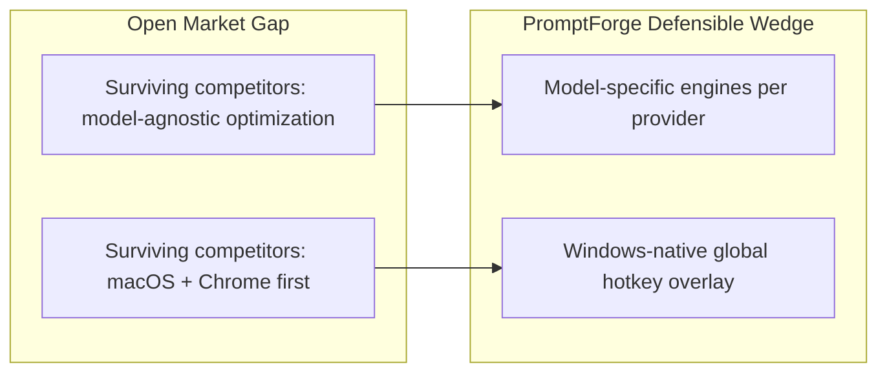
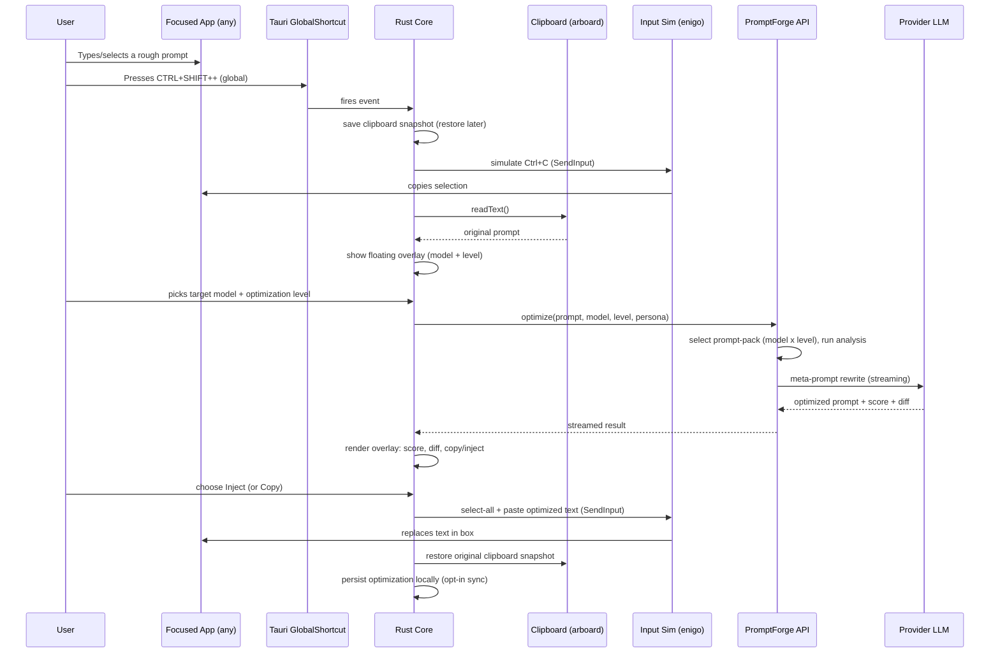
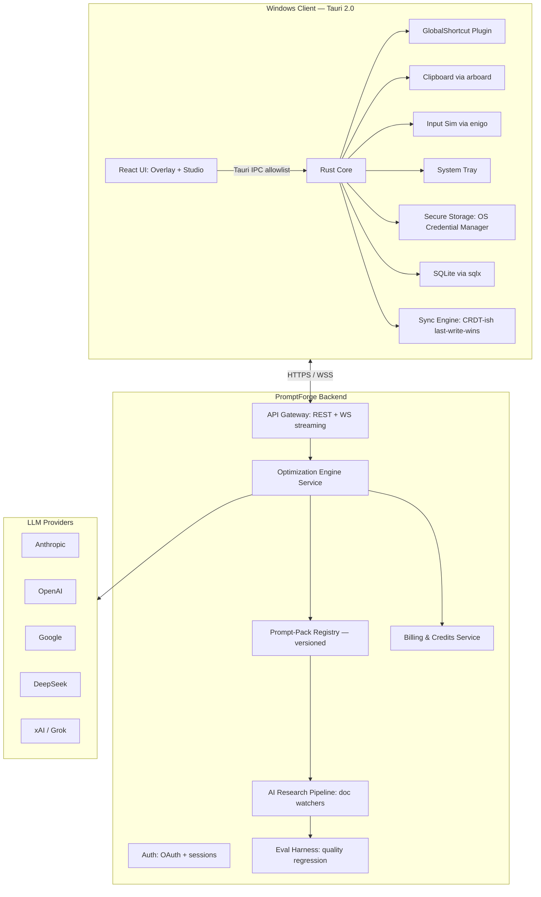
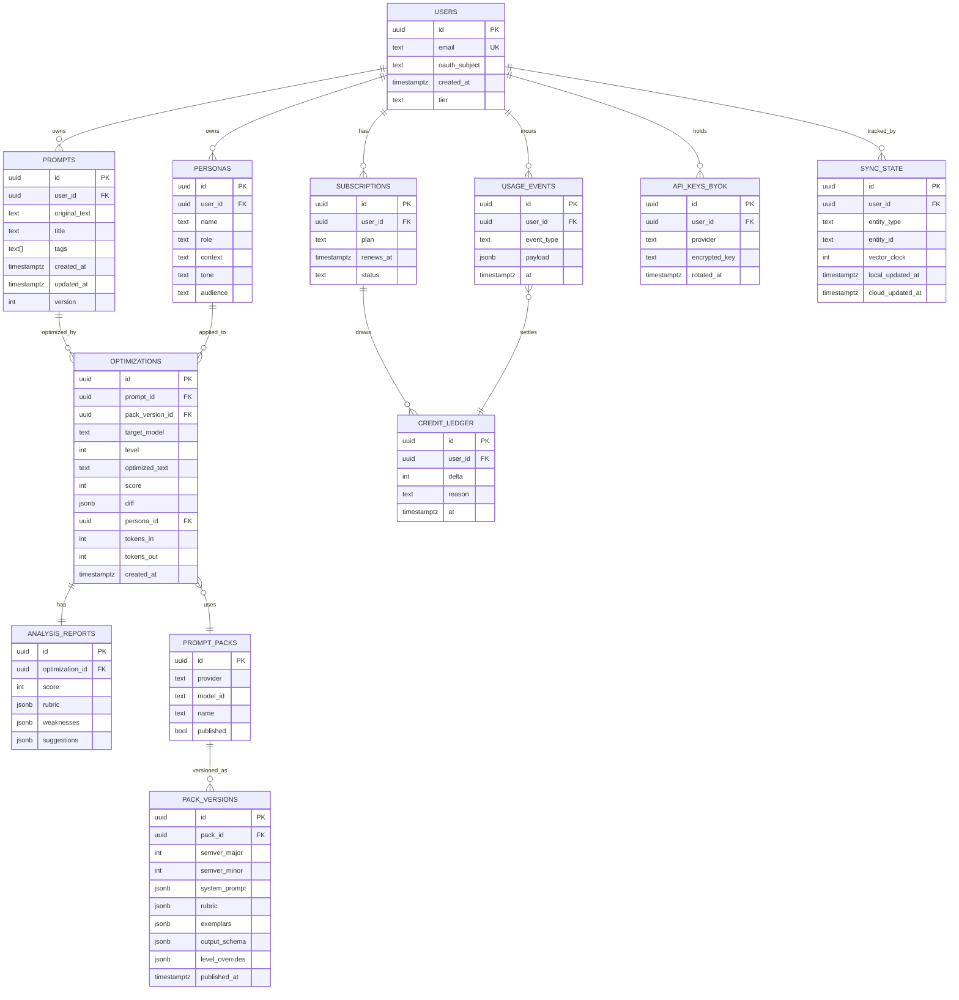

# PromptForge — Product & Architecture Concept Document

> A Windows-native AI prompt optimization studio that rewrites ordinary prompts into
> model-specific, high-performance versions before they reach the AI — summoned by a global
> hotkey from any text box on the system.

**Status:** Concept v1.0 · Author: Product Architecture · Date: Jun 2026

---

## Executive Summary

PromptForge is a desktop application that sits between the user and the AI model they are
prompting. The user writes a normal, unstructured prompt ("Improve my SaaS landing page."),
presses a global hotkey, and PromptForge rewrites that prompt according to the **official
prompt-engineering methodology of the specific target model** (Claude Opus 4.8, GPT-5,
Gemini 3, DeepSeek, Grok), then either injects the optimized prompt back into the original
text box or copies it to the clipboard.

The thesis is two-fold and defensible:

1. **Model-specific, not model-agnostic.** Every surviving competitor optimizes prompts into
   one "good" generic structure. But the published evidence is clear that prompting
   techniques are not portable: Anthropic, OpenAI, Google, DeepSeek, and xAI each publish
   distinct, frequently updated guidance. PromptForge treats each model's optimization
   framework as first-class, versioned, and auto-updating.
2. **Windows-native paste-anywhere hotkey.** The competitive field is macOS- and
   Chrome-extension-first. A true system-wide Windows overlay that works in ChatGPT Desktop,
   Cursor, VS Code, Notion, Word, browsers, and terminals is an open lane.

The timing is unusually clean: `PromptPerfect`, the category leader, is shutting down on
**September 1, 2026** ([PromptPerfect Alternative 2026: Best Replacement After Shutdown](https://promptitin.com/promptperfect-alternative), [PromptPerfect - AI Prompt Generator and Optimizer](https://promptperfect.jina.ai/)), leaving a documented, migrating user base actively looking for a replacement ([PromptPerfect Alternative — Migrate Before September 2026](https://www.promptai360.com/promptperfect-alternative)).

This document specifies the full product, architecture, schema, UX, roadmap, monetization,
MVP, scaling, risks, and implementation plan.

---

## 1. Product Vision

### One-liner
PromptForge turns any prompt into the best possible prompt for the model it is destined for,
instantly, from anywhere on Windows.

### North Star
> Every prompt a user sends to any AI is automatically shaped to that model's proven
> optimization framework — with zero friction and measurable, demonstrated lift in output
> quality.

### The two-axis thesis



- **Axis 1 — Model specificity.** A Claude Opus 4.8 prompt, a GPT-5 prompt, and a Gemini 3
  prompt are not interchangeable. Each provider publishes and iterates its own framework
  ([8 Best Prompt Engineering Tools in 2026](https://orq.ai/blog/prompt-engineering-tools)).
  PromptForge maintains a versioned optimization engine per model and updates it as guidance
  evolves.
- **Axis 2 — Frictionless Windows capture.** No copy-paste round-trip to a web dashboard.
  A hotkey fires a floating overlay over whatever app has focus, captures the active text,
  optimizes, and returns the result in place.

### Target users (primary → secondary)
1. **Power users & prompt-curious professionals** — marketers, founders, analysts, writers
   who use multiple AI tools daily and know their prompts are weak but don't want to study
   prompt engineering.
2. **Developers & AI builders** — people who live in Cursor, VS Code, terminals, and AI
   playgrounds and want deterministic, high-quality prompts fast.
3. **Teams & agencies** — shared prompt libraries, consistent quality, brand/persona memory.

### Non-goals (explicit)
- Not an LLM provider. PromptForge does not answer the prompt; it only shapes it.
- Not a generic chat UI. The Studio is a prompt workbench, not a chat surface.
- Not model-agnostic. We will not collapse all engines into one "good enough" template.

---

## 2. Market Analysis

### Why now (timing)
- **PromptPerfect, the incumbent, shuts down September 1, 2026**, following Elastic's October
  2025 acquisition of Jina AI ([PromptPerfect Alternative 2026: Best Replacement After Shutdown](https://promptitin.com/promptperfect-alternative),
  [PromptPerfect - AI Prompt Generator and Optimizer](https://promptperfect.jina.ai/)). Its
  paying user base is being actively migrated by replacements offering 25% switch discounts
  ([PromptPerfect Is Shutting Down: What You Need to Know](https://www.promptai360.com/blog/promptperfect-shutting-down)).
- **Prompting is not a solved problem.** Every major provider publishes and updates its own
  guidance, meaning "good prompting" is a moving, model-dependent target — exactly the
  maintenance burden an auto-updating product offloads from users.

### Market sizing (rough, top-down)
- **TAM (Total Addressable Market):** Global users of generative AI assistants. With
  ChatGPT-scale active users in the hundreds of millions plus Claude/Gemini/Copilot users,
  the universe of people who prompt regularly is plausibly **300M+**. Even a tiny paid
  conversion is a large number.
- **SAM (Serviceable Available Market):** Windows users of AI tools who prompt in English and
  are willing to install a desktop utility. Windows is ~70% of desktop OS share; conservatively
  tens of millions of likely candidates.
- **SOM (Serviceable Obtainable Market, 24-month):** A realistic wedge of
  ~100K–500K activated free users and ~3–8% paid conversion → **3K–40K paying users** in the
  first two years, in line with comparable utility-pricing tools at ~$9–12/mo.

### Demand drivers
- Multiplication of frontier models (Claude Opus/Sonnet, GPT-5, Gemini 3, DeepSeek, Grok) —
  users juggle several and cannot track each one's best practices.
- Rising professional reliance on AI for revenue-generating work, where prompt quality
  directly affects output quality and time.
- The documented migration event from PromptPerfect creates a ready, searching audience.

### Trends working in favor
- Provider-published prompt guides are becoming more formal and more frequently revised.
- Desktop AI apps (ChatGPT Desktop, Cursor, Claude Desktop) normalize "AI as a local app,"
  creating room for adjacent desktop utilities.
- Users increasingly want **memory/persona/context** baked in, not just one-shot rewrites.

---

## 3. Competitive Analysis

The field splits into three camps. No incumbent combines **model-specific engines** with a
**Windows-native system-wide hotkey**. That intersection is PromptForge's lane.

### Camp A — Direct prompt enhancers (closest substitutes)

- **PromptAI (promptai360.com).** Chrome extension + macOS desktop app; enhances prompts
  inside ChatGPT/Claude/Gemini/Copilot/Perplexible; fine-tuned GPT-4.1 rewriter; from
  $7.99/mo; **explicitly model-agnostic** ("prompts are model-agnostic, so the same enhanced
  output works across every LLM"). macOS ⌘⇧P hotkey for Cursor/Claude Code/terminals
  ([PromptPerfect Alternative — Migrate Before September 2026](https://www.promptai360.com/promptperfect-alternative),
  [PromptPerfect Is Shutting Down: What You Need to Know](https://www.promptai360.com/blog/promptperfect-shutting-down)).
  *Gap we exploit: no Windows desktop app; model-agnostic by design, not model-specific.*
- **PromptItIn (promptitin.com).** Structured ROLE/CONTEXT/TASK/CONSTRAINTS/FORMAT framework;
  personalized memory; 5-dimension quality score; supports ChatGPT/Claude/Gemini/Grok/DeepSeek/Cursor;
  free 2/day, $9/mo Pro, $49/mo Team (5 seats); paste-anywhere
  ([PromptPerfect Alternative 2026: Best Replacement After Shutdown](https://promptitin.com/promptperfect-alternative)).
  *Gap: browser-/web-centric, single shared framework rather than per-provider engines, no
  native Windows hotkey capture.*
- **FlashPrompt.** Lightweight browser one-click enhancer; narrower model support and feature
  set ([PromptPerfect Is Shutting Down: What You Need to Know](https://www.promptai360.com/blog/promptperfect-shutting-down)).
  *Gap: shallow feature set, extension-only.*
- **AIPRM.** Community-rated prompt templates for ChatGPT only
  ([PromptPerfect Is Shutting Down: What You Need to Know](https://www.promptai360.com/blog/promptperfect-shutting-down)).
  *Gap: ChatGPT-only, template library not a live optimizer.*

### Camp B — Open-source / self-host

- **Prompt Optimizer (linshenkx).** Open-source desktop app + Chrome extension + Docker; MCP
  support for Claude Desktop; avoids browser CORS ([8 Best Prompt Engineering Tools in 2026](https://orq.ai/blog/prompt-engineering-tools),
  search synthesis). *Gap: technical setup, no managed cloud sync/billing, generic
  optimization, no Windows-native capture UX.*

### Camp C — Developer-facing prompt platforms (different buyer)

- **orq.ai, LangChain, Agenta, Promptmetheus, Helicone** — prompt management, testing,
  debugging, observability for teams shipping LLM apps ([8 Best Prompt Engineering Tools in 2026](https://orq.ai/blog/prompt-engineering-tools)).
  *Gap: built for engineers managing prompt pipelines in production, not for an end user
  who just wants a better prompt right now. Different persona, different surface.*

### Competitive gap matrix (textual)

- **Model-specific engines:** PromptAI no · PromptItIn partial (one framework) · FlashPrompt
  no · AIPRM no · Prompt Optimizer no · orq.ai n/a · **PromptForge YES.**
- **Windows-native system-wide hotkey:** PromptAI macOS-only · PromptItIn web/paste ·
  FlashPrompt extension · AIPRM extension · Prompt Optimizer desktop but generic · **PromptForge YES.**
- **Auto-updating optimization frameworks (AI Research Mode):** all competitors manual/stale ·
  **PromptForge YES (reviewed).**
- **Quality score + diff comparison view:** PromptItIn has scoring; others minimal ·
  **PromptForge YES (full diff + rubric).**
- **Persona/context memory:** PromptItIn yes; others minimal · **PromptForge YES.**

### Differentiation risk
The differentiation is real but not patentable. The moat is **execution speed on the
auto-updating, model-specific engine packs plus a polished Windows capture UX**, reinforced
by switching costs from saved prompt libraries and persona memory.

---

## 4. User Workflow

### Two surfaces, one engine

1. **Floating overlay** — the primary, fast surface (the killer feature).
2. **Studio** — the full workbench for analysis, comparison, persona management, library.

### Primary flow: hotkey → optimize → inject

The user is typing a prompt into any text box (ChatGPT Desktop, Cursor, a browser, Word,
Notion, a terminal). No OS exposes "the selected text" to a foreign app, so the proven
pattern is hotkey → simulate copy → read clipboard → optimize → re-inject
([Gets the user selected text? · tauri-apps Discussion #5624](https://github.com/tauri-apps/tauri/discussions/5624),
[How do I get the selected text from the focused window using native Win32 API?](https://stackoverflow.com/questions/2251578/how-do-i-get-the-selected-text-from-the-focused-window-using-native-win32-api),
[I Built a Local Voice-to-Text App with Tauri 2.0, whisper.cpp, and llama.cpp](https://dev.to/auratech/i-built-a-local-voice-to-text-app-with-rust-tauri-20-whispercpp-and-llamacpp-heres-how-32h5)).



### Edge cases handled in the flow
- **No selection / empty clipboard after Ctrl+C** → overlay opens in "compose" mode so the
  user can type or paste a prompt directly.
- **Secure input fields that block synthetic input** (some password/protected boxes) → fall
  back to **Copy to clipboard** and show a toast; never fail silently.
- **Clipboard clobber** → snapshot the user's clipboard before the simulated copy and restore
  it after injection, so we don't destroy what they had copied.
- **Debounce** → ignore rapid re-trigger of the hotkey; if the overlay is already open, the
  same hotkey dismisses it.
- **Hotkey conflict** → user-reassignable; detect collisions with common apps at startup.

### Studio flow (deliberate workbench)
1. Open Studio from tray or hotkey variant.
2. Paste or load a prompt from library.
3. Run **Analyze** → quality score (1–100) + rubric breakdown + detected weaknesses.
4. Pick target model + optimization level (1–4) → **Optimize**.
5. View **Original vs Optimized** side-by-side diff with highlighted improvements.
6. Edit optimized prompt, save to library with tags, or copy/inject.
7. Manage **personas** and **context memory** (job, audience, tone) applied automatically.

---

## 5. Technical Architecture

### Framework decision: Tauri 2.0 (Rust + WebView2)

Chosen over Electron for this product specifically:

- **Bundle size & footprint:** ~8MB shell vs Electron's 150MB+ for Chromium
  ([I Built a Local Voice-to-Text App with Tauri 2.0](https://dev.to/auratech/i-built-a-local-voice-to-text-app-with-rust-tauri-20-whispercpp-and-llamacpp-heres-how-32h5)).
  A resident tray utility must be light.
- **Native OS integration:** Tauri 2.0 plugins for global hotkeys, clipboard, system tray,
  notifications are first-class and clean
  ([I Built a Local Voice-to-Text App with Tauri 2.0](https://dev.to/auratech/i-built-a-local-voice-to-text-app-with-rust-tauri-20-whispercpp-and-llamacpp-heres-how-32h5),
  [Gets the user selected text? · tauri-apps Discussion #5624](https://github.com/tauri-apps/tauri/discussions/5624)).
- **Security model:** allowlist-based IPC — the webview can only invoke explicitly permitted
  Rust commands ([I Built a Local Voice-to-Text App with Tauri 2.0](https://dev.to/auratech/i-built-a-local-voice-to-text-app-with-rust-tauri-20-whispercpp-and-llamacpp-heres-how-32h5)).
  Critical for an app that handles user prompts and API keys.
- **Native input injection:** `enigo` for keystroke simulation, `arboard` for clipboard
  ([Gets the user selected text? · tauri-apps Discussion #5624](https://github.com/tauri-apps/tauri/discussions/5624)).

Frontend: **React + TypeScript + Tailwind + shadcn/ui** inside the WebView2 surface — modern,
fast to iterate, and good enough for a utility UI (Tauri uses the OS webview, which is fine
for a utility app though not pixel-identical cross-platform
([I Built a Local Voice-to-Text App with Tauri 2.0](https://dev.to/auratech/i-built-a-local-voice-to-text-app-with-rust-tauri-20-whispercpp-and-llamacpp-heres-how-32h5))).

### Component diagram



### Client core responsibilities (Rust)
- Register/unregister the global hotkey; surface conflicts.
- On trigger: snapshot clipboard → simulate Ctrl+C → read clipboard → spawn overlay.
- Hold model/level selection state; call backend with streaming.
- Inject result via select-all + paste, or copy + toast fallback.
- Securely store the user's auth token and (optional) BYOK provider keys in the Windows
  Credential Manager (never in plaintext config).
- Local SQLite cache of library, history, personas, and a mirror of prompt-packs for offline
  use.
- Sync engine: last-write-wins per record with vector clocks; offline-first.

### Backend responsibilities
- **Optimization Engine Service:** the heart. Given `(prompt, targetModel, level, persona,
  context)`, it (a) runs **Analysis** to produce the quality score and weakness list, (b)
  assembles the **meta-prompt** from the matching prompt-pack, (c) calls the appropriate
  provider LLM to do the rewrite, (d) returns optimized prompt + score + diff. Streaming via
  WebSocket.
- **Prompt-Pack Registry:** versioned, model-specific packs (see "Engines as data" below).
  Served to clients for local caching; hot-updatable without client releases.
- **Provider Abstraction Layer:** one interface to Anthropic/OpenAI/Google/DeepSeek/xAI with
  per-provider auth, retries, rate-limit handling, and cost accounting.
- **Billing & Credits:** meters token spend per optimization, deducts credits, enforces free
  tier caps. BYOK path bypasses managed billing (user's own key, their own cost).
- **Auth:** email/OAuth (Google/GitHub) sessions; token refresh.
- **AI Research Pipeline:** scheduled crawlers/watchers of official provider docs; diff vs
  last known; draft new prompt-pack versions; queue for human review; on approval publish to
  the Registry and bump the eval harness.

### Engines as data, not code (the key architectural decision)
Each "engine" is a **versioned prompt-pack**, not a compiled module:

- `system_prompt` — the meta-instructions that turn the optimizer LLM into an expert for that
  target model (e.g., "You are an Anthropic prompt-engineering specialist applying Claude
  Opus 4.8 best practices: XML-tagged structure, explicit role, step-by-step thinking,
  examples...").
- `analysis_rubric` — the weights and checks for the 1–100 quality score.
- `exemplars` — few-shot before/after pairs curated from official docs and benchmarks.
- `output_schema` — structured JSON the optimizer must return (optimized_prompt, score,
  diff, persona_suggestion, notes).
- `level_overrides` — per optimization level (1–4): depth, token budget, whether to add
  examples/persona/chain-of-thought, latency/cost targets.

Benefits: new models added by authoring a pack (no client release); auto-updating frameworks
is just publishing pack versions; the plugin architecture exposes the same pack format to
third parties; A/B testing packs is trivial. Cost: prompt-pack quality is the product — it
needs an eval harness and curation discipline (see §11, §12).

### Optimization Levels (1–4)
- **L1 Light Enhancement** — quick cleanup: clarity, structure, remove ambiguity. Fast,
  cheap, deterministic-feeling. ~1 LLM call, small token budget.
- **L2 Professional Enhancement** — add role/persona, explicit context, constraints, output
  format. The default. ~1–2 calls, medium budget.
- **L3 Expert Prompt Engineer** — full framework: persona, context, task decomposition,
  examples, chain-of-thought cues, negative constraints, output schema, verification steps.
  ~2 calls (analyze then rewrite), larger budget.
- **L4 Maximum Capability Mode** — L3 plus multi-shot self-critique: optimize → critique →
  refine, possibly model-specific advanced techniques (e.g., Anthropic's extended thinking
  priming, Google's "show your work" patterns). Highest quality, highest latency/cost.

### Performance targets
- Overlay appears **<150ms** after hotkey (local).
- End-to-end optimization **<2s for L1–L2**, **<5s for L3**, **<12s for L4**, with streaming
  so the user sees progress.
- Identical-input caching (hash of prompt+model+level+persona) to dedup repeat optimizations.
- Prompt-packs cached locally so the overlay works offline for cached models.

---

## 6. Database Schema

Local **SQLite** (client, via `sqlx`) and cloud **PostgreSQL** (backend). Shared entities
sync between them; the cloud is the system of record for packs, billing, and accounts; the
client is the system of record for transient local state.

### Entity-relationship diagram



### Local-only (SQLite) tables
- `app_settings` (hotkey, theme, default model/level, telemetry opt-in).
- `clipboard_snapshots` (transient, for restore).
- `cache_prompt_packs` (mirror of published packs for offline use).
- `cache_optimizations` (input-hash → result, for dedup).

### Notes
- BYOK keys are encrypted at rest (server) and/or stored only in the client OS Credential
  Manager (preferred for consumer trust).
- `OPTIMIZATIONS.diff` is a JSON patch so the Studio can render a clean highlight diff.
- `PACK_VERSIONS` is immutable once published; clients pin a version and can roll forward.

---

## 7. UI / UX Design

### Design language
- **Aesthetic:** quiet, fast, premium-utility. Dark-first, glassy floating overlay, high
  contrast, restrained accent color (single brand hue). Think Raycast/Linear polish, not a
  busy dashboard.
- **Motion:** overlay springs in (~120ms), results stream into place, no jank. Respect
  `prefers-reduced-motion`.
- **Density:** overlay is sparse and glanceable; Studio is denser and information-rich.

### The floating overlay (primary surface)
A small, borderless, always-on-top window anchored near the caret/cursor:

- **Top row:** target model picker (Claude Opus 4.8, Claude Sonnet, GPT-5, Gemini 3, DeepSeek,
  Grok) + optimization level segmented control (1 2 3 4).
- **Middle:** original prompt (collapsed, one line) → optimized prompt (streaming in,
  monospace-ish).
- **Quality score ring:** 1–100 with rubric chips (clarity, context, constraints, format,
  examples, persona) color-coded.
- **Actions:** `Inject` (primary), `Copy`, `Edit`, `Open in Studio`, `Dismiss`.
- **Keyboard-first:** Tab between model/level, Enter to inject, Esc to dismiss, `1–4` to set
  level instantly. Mouse optional.

### The Studio (full workbench)
- **Left rail:** Library (tagged, searchable, versioned prompts), Personas, History, Settings.
- **Center:** the workbench — Original | Optimized split with a **highlighted diff** (added
  structure, added persona, added constraints, added output format all color-tagged).
- **Right panel:** Analysis (score + rubric + detected weaknesses + suggestions) and the
  auto-generated **Persona** with a one-click "apply to all" toggle.
- **Top bar:** model + level, persona selector, sync status, credits remaining.

### Comparison / diff view
- Side-by-side and unified-diff toggle.
- Improvements annotated inline: "+ Role/persona", "+ Constraints", "+ Output format",
  "+ Example", "Reordered for clarity". Each tag is clickable to explain why (ties into the
  "learn-as-you-go" idea competitors like PromptItIn use
  ([PromptPerfect Alternative 2026: Best Replacement After Shutdown](https://promptitin.com/promptperfect-alternative))).

### Auto Persona Generation
- On optimize, the engine proposes the best expert role. Example transformation:
  - Before: "Help me improve my landing page."
  - Auto persona: "You are a world-class SaaS conversion optimization specialist with
    expertise in UX, copywriting, behavioral psychology, and CRO."
- Personas are saved, reusable, and can be set as a persistent default with context memory
  (job, goals, audience, tone) — matching the memory layer users now expect
  ([PromptPerfect Alternative 2026: Best Replacement After Shutdown](https://promptitin.com/promptperfect-alternative)).

### System tray & onboarding
- Tray icon: quick actions (Open Studio, New optimization, Settings, Quit) + credits badge.
- First-run onboarding: 3 slides (capture model, model-specific thesis, hotkey), then a
  guided "try it now" that fires the overlay on a sample prompt. Telemetry opt-in here, not
  buried.

### Accessibility
- Full keyboard navigation; overlay is screen-reader-announced; scores have text alternatives
  not just color; min touch target 32px; respects system theme and scaling.

---

## 8. Feature Roadmap

### Phase 0 — Foundation (pre-MVP, weeks 0–6)
- Tauri shell, global hotkey, clipboard capture/inject, tray, secure storage, local SQLite.
- Backend skeleton: auth, Optimization Engine Service for **one** model (Claude) at **two**
  levels, prompt-pack registry, streaming.
- Eval harness v0 (the "is model-specific actually better?" proof — see §12).

### Phase 1 — MVP (weeks 6–14)
- 4 models (Claude Opus 4.8, GPT-5, Gemini 3, DeepSeek or Grok), Levels 1–2.
- Overlay with model picker, level, score, copy + inject.
- Managed credits + free tier + Pro subscription + BYOK toggle.
- Local library + history. Cloud sync for library.
- See §10 for exact in/out.

### Phase 2 — v1 (months 4–7)
- Levels 3–4 (expert + maximum, with self-critique).
- Studio: full diff/comparison, analysis panel, auto-persona, context memory.
- AI Research Mode v1 (doc watchers → human-reviewed pack updates).
- Team plan: shared library, seats, roles.
- 2 more models (full Grok + DeepSeek; Sonnet variant).

### Phase 3 — v2 (months 8–14)
- Plugin architecture: third-party prompt-packs, custom engines, MCP integration (mirroring
  open-source competitors' MCP support ([8 Best Prompt Engineering Tools in 2026](https://orq.ai/blog/prompt-engineering-tools)).
- Public API for developers.
- macOS port (respond to demand; Windows-first remains).
- Eval-driven pack A/B testing and automatic promotion of winning packs.

### Phase 4 — Platform (months 15+)
- Marketplace for community prompt-packs and personas.
- Enterprise: SSO, audit logs, on-prem engine option, data residency.
- Optional local inference for L1 (privacy tier).

---

## 9. Monetization Strategy

### Tiers
- **Free:** 3–5 optimizations/day, Levels 1–2 only, 2 models, local library, no sync. A real,
  useful tier that drives adoption and virality.
- **Pro (~$9–12/mo, annual discount):** unlimited optimizations, all models, Levels 1–4,
  cloud sync, personas + memory, diff/Studio. Anchored to competitor pricing: PromptItIn
  $9/mo Pro, PromptAI $7.99/mo
  ([PromptPerfect Alternative 2026: Best Replacement After Shutdown](https://promptitin.com/promptperfect-alternative),
  [PromptPerfect Alternative — Migrate Before September 2026](https://www.promptai360.com/promptperfect-alternative)).
- **Team (~$49/mo, 5 seats, then per-seat):** everything in Pro + shared library, roles,
  billing centralization. Matches PromptItin's Team $49/5-seat anchor
  ([PromptPerfect Alternative 2026: Best Replacement After Shutdown](https://promptitin.com/promptperfect-alternative)).
- **BYOK mode:** users supply their own provider keys; pay a small platform fee (~$3–5/mo) or
  a metered rate instead of per-optimization credits. Their token spend is their own.
- **Credits add-on:** for free users who occasionally exceed the cap, or Pro users who want
  L4 bursts.

### Cost model (per optimization)
Managed mode cost is dominated by provider token spend. Illustrative economics (subject to
provider pricing changes):

- **L1:** ~1.5K tokens in/out blended → est. **~$0.005** per optimization.
- **L2:** ~3K tokens → **~$0.01**.
- **L3:** ~7K tokens (2 calls) → **~$0.02**.
- **L4:** ~15K tokens (optimize + critique + refine) → **~$0.05**.

If an average paying user runs ~150 optimizations/month weighted toward L1–L2, blended COGS
is roughly **$1.50–2.50/user/month**. At $9–12/mo Pro, **gross margin ≈ 75–85%**, with BYOK
users essentially free to serve (near-zero COGS, small platform fee). L4 heavy users are the
margin risk — mitigated by level-based credit costs and soft caps.

### Revenue logic
- Land via Free; convert via daily-cap friction and the visible quality score (users *see*
  their prompt jump from 42 → 91 and want more).
- Team expansion via shared library network effects.
- BYOK captures the price-sensitive power-user segment that would otherwise churn, at near
  zero COGS.

### Migration play
Time the launch and a "switch from PromptPerfect" onboarding flow to the September 2026
shutdown window; offer a migration import for exported PromptPerfect libraries
([PromptPerfect Is Shutting Down: What You Need to Know](https://www.promptai360.com/blog/promptperfect-shutting-down)).

---

## 10. MVP Scope

### In (the smallest lovable product)
- Windows Tauri app: global hotkey, clipboard capture, inject-or-copy, tray, secure storage.
- Overlay: model picker (4 models), Level 1–2 selector, quality score, Copy + Inject.
- Backend: Optimization Engine for 4 models × 2 levels, prompt-pack registry, streaming,
  auth, managed credits + free tier + Pro, BYOK toggle.
- Analysis + 1–100 score with rubric chips (in the overlay, compact).
- Local library + history; cloud sync of library only.
- Onboarding + telemetry opt-in + a "switch from PromptPerfect" import.

### Out (deliberately deferred from MVP)
- Levels 3–4 (expert/maximum) — later.
- The full Studio diff/comparison view — MVP shows score + result in overlay only.
- Auto Persona Generation as a saved, reusable library — MVP auto-generates inline only.
- AI Research Mode — later.
- Team plan, marketplace, plugins, public API, macOS — later.
- Local/offline inference — later.

### MVP success criteria
- Hotkey→inject in **<2s** for L1–L2 at p95.
- At least one model where the eval harness shows optimized prompts beat baseline by a
  measurable margin (the core credibility proof).
- Free→Pro conversion ≥ 3%.
- Day-7 retention ≥ 25% for activated free users.

---

## 11. Scaling Plan

### Infrastructure
- Stateless Engine Service behind a load balancer; autoscale on WebSocket connections and
  provider rate limits.
- Prompt-pack Registry behind a CDN; clients cache locally and revalidate via ETag/version.
- Postgres for accounts/library/billing (managed, read replicas for library reads).
- Redis for: identical-input result cache, rate limiting, session store, streaming fan-out.
- Per-provider outbound proxy pool to manage rate limits and failover across regions.

### Cost & latency levers
- **Input-hash caching:** identical `(prompt, model, level, persona)` returns cached result —
  huge for repeat power users and template-driven workflows.
- **Level-based model routing:** L1 may use a cheaper/faster model for the rewrite than L4,
  cutting COGS without hurting perceived quality.
- **Regional inference:** route to nearest provider region; cache packs at edge.
- **Streaming everywhere** so perceived latency is far below actual latency.

### Quality scaling — the Eval Harness (critical)
Scaling the *product* means scaling *engine quality* without regressions. The eval harness is
a first-class system:

- A curated benchmark set of weak prompts with reference "good" optimized prompts per model.
- For each candidate prompt-pack version: run the benchmark, score outputs on a rubric
  (clarity, structure, constraints, format, examples, persona), and compare against the
  incumbent pack and against a baseline unoptimized prompt fed to the target model.
- **Promotion gate:** a new pack version only ships if it beats the incumbent on the rubric
  *and* demonstrates real downstream lift (optimized prompt → target model produces a
  better-rated answer than the original prompt → target model).
- This is also the answer to the hardest risk (§12): proving model-specific optimization is
  actually better, not just longer.

### Organizational scaling
- Phase 0–1: 1 founder/PM + 1 Rust/client eng + 1 backend eng + 1 prompt-engineer/eval
  (contractor ok).
- Phase 2: +1 frontend/design, +1 backend, +1 eval/quality.
- Phase 3+: platform team, partnerships with providers.

---

## 12. Risks and Challenges

1. **"Is model-specific actually better?" (existential).** The whole thesis rests on
   model-specific packs outperforming a single generic optimizer. Mitigation: the Eval Harness
   (§11) must prove measurable downstream lift before launch, and be the promotion gate for
   every pack change. If we can't prove it, we reposition — but the eval is what makes the
   claim credible to users and investors.

2. **Provider API & pricing churn.** Models, pricing, and best practices change constantly
   (the PromptPerfect shutdown itself shows how fast this space moves
   ([PromptPerfect - AI Prompt Generator and Optimizer](https://promptperfect.jina.ai/)).
   Mitigation: provider abstraction layer; prompt-packs-as-data; AI Research Mode; level-based
   cost controls; BYOK as a hedge against any single provider's pricing shock.

3. **Cost blowout on L4 / heavy users.** Self-critique loops are expensive. Mitigation:
   credit-cost per level, soft caps, BYOK, input caching, cheaper-model routing for L1–L2.

4. **Synthetic input blocking.** Some apps and secure fields block simulated keystrokes, so
   inject-in-place can fail ([I Built a Local Voice-to-Text App with Tauri 2.0](https://dev.to/auratech/i-built-a-local-voice-to-text-app-with-rust-tauri-20-whispercpp-and-llamacpp-heres-how-32h5)).
   Mitigation: graceful Copy-to-clipboard fallback + toast; never fail silently; maintain a
   compatibility list and per-app injection strategies.

5. **Security of keys & prompts.** Handling user API keys and potentially sensitive prompts.
   Mitigation: OS Credential Manager for keys; encryption in transit and at rest; no prompt
   content stored server-side without explicit consent; telemetry opt-in; BYOK keys kept
   client-side by default; allowlist IPC; regular security review.

6. **Competitor fast-follow.** Model-specificity and a Windows hotkey are copyable.
   Mitigation: speed of the auto-updating pack pipeline, eval-gated quality, switching costs
   via library/persona memory, and brand built around "the model-specific one."

7. **Tauri cross-platform rendering variance.** OS webview differs across platforms
   ([I Built a Local Voice-to-Text App with Tauri 2.0](https://dev.to/auratech/i-built-a-local-voice-to-text-app-with-rust-tauri-20-whispercpp-and-llamacpp-heres-how-32h5)).
   Mitigation: Windows-first MVP; defer macOS; keep UI simple and resilient; test on WebView2
   explicitly.

8. **Dependency on third-party LLMs for the core function.** If a provider blocks
   meta-prompting or changes ToS, the engine for that model is at risk. Mitigation: BYOK
   shifts the relationship to the user; multiple provider backends; the rewrite LLM need not
   be the same as the target model.

9. **Clipboard UX friction.** The capture flow briefly clobbers the clipboard. Mitigation:
   snapshot/restore; debounce; clear visual state; compose-mode fallback when nothing is
   selected.

10. **Trust / "did it actually improve?"** Users can't easily tell if an optimized prompt is
    better until they run it. Mitigation: the visible score + diff + the "explain every
    change" pattern users like in competitors
    ([PromptPerfect Alternative 2026: Best Replacement After Shutdown](https://promptitin.com/promptperfect-alternative)),
    plus optional before/after answer comparison in the Studio.

---

## 13. Implementation Plan

### Milestone sequence

- **M0 (weeks 0–2):** Repo, CI, Tauri shell, global hotkey + clipboard capture/inject spike,
  secure storage. Prove the hardest technical unknown first (system-wide capture).
- **M1 (weeks 2–6):** Backend skeleton; Optimization Engine for Claude at L1–L2; prompt-pack
  registry; streaming; auth. Eval harness v0 with a 30-prompt benchmark for Claude.
- **M2 (weeks 6–10):** Add GPT-5 and Gemini 3 packs; overlay UI (model picker, level, score,
  copy/inject); managed credits + free tier + Pro + BYOK; local library.
- **M3 (weeks 10–14):** Add 4th model (DeepSeek or Grok); cloud sync of library; onboarding;
  PromptPerfect migration import; telemetry; beta to waitlist.
- **M4 (weeks 14–20):** Hardening, p95 latency work, security review, Windows signing/MSIX
  packaging, auto-update. Public launch timed near the Sept 2026 shutdown window
  ([PromptPerfect Alternative — Migrate Before September 2026](https://www.promptai360.com/promptperfect-alternative)).
- **M5 (months 5–7):** v1 — Levels 3–4, Studio diff view, auto-persona + memory, AI Research
  Mode v1, Team plan.
- **M6 (months 8–14):** v2 — plugins/MCP, public API, macOS port, eval-driven A/B pack
  promotion.
- **M7 (months 15+):** Platform — marketplace, enterprise.

### Build principles
- Prove the riskiest unknown (system-wide capture) in M0, not M4.
- Prove the core claim (model-specific lift) with the eval harness in M1, before scaling
  packs.
- Prompt-packs-as-data from day one — never hardcode an engine in the client.
- Ship the overlay first, the Studio second; the overlay is the wedge.
- BYOK and managed billing both ship in MVP so we capture both consumer and power-user
  segments at launch.

### Team & effort (to MVP, ~14 weeks)
- 1 PM/founder (vision, packs, eval curation, GTM).
- 1 Rust/Tauri engineer (client core, capture, inject, secure storage).
- 1 backend engineer (engine service, registry, billing, sync).
- 1 frontend/design (overlay + Studio UX).
- 1 prompt-engineering/eval contractor (pack authoring, benchmark, rubric).
- Stretch: 1 part-time DevOps/security for signing, auto-update, infra.

---

## Appendix A — Prompt Analysis Rubric (the 1–100 score)

Six dimensions, weighted:

- **Clarity & specificity (25):** is the task unambiguous?
- **Context (20):** background, audience, constraints provided?
- **Structure (15):** organized, separable instructions?
- **Output format (15):** is the desired response shape specified?
- **Examples / evidence (10):** few-shot or reference examples included?
- **Persona / role (10):** expert role set?
- **Verifiability (5):** success criteria / checks defined?

Each scored 0–full; summed to 100. The engine emits per-dimension sub-scores and a weakness
list (e.g., "missing output format", "no examples", "vague task"), which drive both the score
and the highlighted improvements in the diff view.

## Appendix B — Example prompt-pack shape (Claude Opus 4.8, L2)

```json
{
  "pack_id": "claude-opus-4.8",
  "version": "1.3.0",
  "provider": "anthropic",
  "model_id": "claude-opus-4-8",
  "system_prompt": "You are an Anthropic prompt-engineering specialist. Rewrite the user's prompt for Claude Opus 4.8 applying: explicit expert role, XML-tagged sections (<context>, <task>, <constraints>, <output_format>, <examples>), clear step-by-step instructions, and concrete success criteria. Preserve the user's intent; do not invent facts. Return structured JSON per the output schema.",
  "rubric": { "clarity": 25, "context": 20, "structure": 15, "format": 15, "examples": 10, "persona": 10, "verifiability": 5 },
  "exemplars": [ { "before": "...", "after": "..." } ],
  "output_schema": {
    "optimized_prompt": "string",
    "score": "int",
    "subscores": "object",
    "diff": "array",
    "persona_suggestion": "string",
    "notes": "array"
  },
  "level_overrides": {
    "1": { "add_examples": false, "add_persona": false, "max_tokens": 1200 },
    "2": { "add_examples": false, "add_persona": true,  "max_tokens": 2400 },
    "3": { "add_examples": true,  "add_persona": true,  "max_tokens": 6000, "self_critique": false },
    "4": { "add_examples": true,  "add_persona": true,  "max_tokens": 12000, "self_critique": true, "passes": 3 }
  }
}
```

## Appendix C — Sources

- [PromptPerfect Alternative 2026: Best Replacement After Shutdown | PromptItIn](https://promptitin.com/promptperfect-alternative)
- [PromptPerfect - AI Prompt Generator and Optimizer (Jina AI)](https://promptperfect.jina.ai/)
- [PromptPerfect Alternative — Migrate Before September 2026 | PromptAI 360](https://www.promptai360.com/promptperfect-alternative)
- [PromptPerfect Is Shutting Down: What You Need to Know | PromptAI](https://www.promptai360.com/blog/promptperfect-shutting-down)
- [8 Best Prompt Engineering Tools in 2026 | orq.ai](https://orq.ai/blog/prompt-engineering-tools)
- [Gets the user selected text? · tauri-apps Discussion #5624](https://github.com/tauri-apps/tauri/discussions/5624)
- [Electron: How do I get the selected text from a focused window? (Stack Overflow)](https://stackoverflow.com/questions/57507526/electron-how-do-i-get-the-selected-text-from-the-focused-window)
- [How do I get the selected text from the focused window using native Win32 API? (Stack Overflow)](https://stackoverflow.com/questions/2251578/how-do-i-get-the-selected-text-from-the-focused-window-using-native-win32-api)
- [How to retrieve the selected text from the active window (Stack Overflow)](https://stackoverflow.com/questions/1007185/how-to-retrieve-the-selected-text-from-the-active-window)
- [I Built a Local Voice-to-Text App with Tauri 2.0, whisper.cpp, and llama.cpp (DEV)](https://dev.to/auratech/i-built-a-local-voice-to-text-app-with-rust-tauri-20-whispercpp-and-llamacpp-heres-how-32h5)
